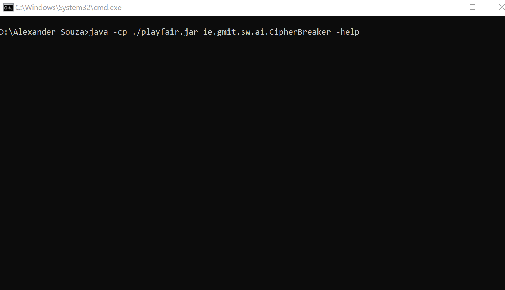
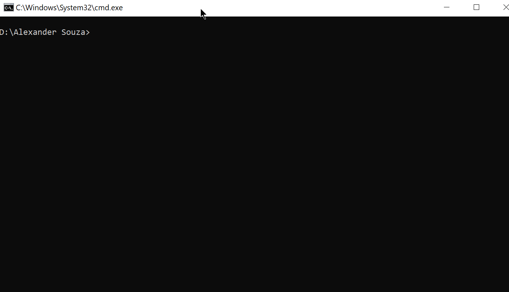

# 4 Year - B.Sc. Software Development
## Artificial Intelligence (2018)
### Simulated Annealing to Break a Playfair Cipher

The field of cryptanalysis is concerned with the study of ciphers, having as its objective the
identification of weaknesses within a cryptographic system that may be exploited to convert
encrypted data (cipher-text) into unencrypted data (plain-text). Whether using symmetric or
asymmetric techniques, cryptanalysis assumes no knowledge of the correct cryptographic key
or even the cryptographic algorithm being used.

### The application

The application will allow the user to make the encryption and decryption of documents of type txt, from a key provided by the user.

The user can also decrypt using a simulated annealing algorithm for breaking cyphers, the user just  enter the name of the text file to be decrypt.

This application consists of two ways to execute:

- Through command line in which the user can execute the application passing parameter directly through the command line.

- Through a user-friendly interface, the user can also access all system options through menus.


## Use CipherBreaker command line


Get help with the options available to the user.
```
java -cp ./playfair.jar ie.gmit.sw.ai.CipherBreaker -help
```
```
Usage:  CipherBreaker COMMAND

Options:
        -dp             Decrypt file (Playfair cipher)
        -d              Decrypt file
        -e              Encrypt file

Decrypt file (Playfair cipher).
        java -cp ./playfair.jar ie.gmit.sw.ai.CipherBreaker -dp <FILENAME>

Decrypt file.
        java -cp ./playfair.jar ie.gmit.sw.ai.CipherBreaker -d <FILENAME> <KEY>

Encrypt file.
        java -cp ./playfair.jar ie.gmit.sw.ai.CipherBreaker -e <FILENAME> <KEY>
```

## Use CipherBreaker as UI



For the user to have access to the UI, just run the application without passing any parameter.
```
java -cp ./playfair.jar ie.gmit.sw.ai.CipherBreaker
```

```
  _____   _______                 _____    __   __   _______  _______
 (_____) (_______)               (_____)  (__)_(__) (_______)(__ _ __)
(_)___(_)   (_)       ______    (_)  ___ (_) (_) (_)   (_)      (_)
(_______)   (_)      (______)   (_) (___)(_) (_) (_)   (_)      (_)
(_)   (_) __(_)__               (_)___(_)(_)     (_) __(_)__    (_)
(_)   (_)(_______)               (_____) (_)     (_)(_______)   (_)

Simulated Annealing to Break a Playfair Cipher
---------------------------------
    Files Availables
---------------------------------

4grams.txt
Encrypted AI Exam Tips.txt
hobbit.txt
TheHobbit-Cypher-Text.txt
TheHobbitCypher.txt
_decryptedMSG.txt
_encryptedMSG.txt
---------------------------------

Enter the file name or URL (EXIT leave).
Encrypted AI Exam Tips.txt

```
### After entering the file name, select one of the following options.
```
---------------------------------
Decrypt or Encrypt
---------------------------------

(1) Decrypt file (Playfair cipher).
(2) Decrypt file.
(3) Encrypt file.

(4) Return to main menu.

```
### The option 1 "Decrypt file (Playfair cipher)", will use the Playfair algorithm to find the key would need to decrypt the document.
```
6% 12% 18% 24% 30% 36% 42% 48% 54% 60% 66% 72% 78% 84% 90% 96%
------------------------------------------------------------------------------------------
Sample output result.: THEREWILLBEFIVEQUESTIONSONTHEXXAMPAPERTHISYEARSTOPYOUAREREQU...
------------------------------------------------------------------------------------------
Decrypt saved on file name: _decryptedMSG.txt
In 54 Seconds.
Break decrypt is Finish...

Press ENTER to return to Main Menu...

```
### For the other options, 2 and 3, just inform key for encryption or decryption of the document, a file will be generated with its result.
```
Enter the keyword to Decrypt or EXIT leave.
TYPE THE KEY
Decrypt saved on file name: _decryptedMSG.txt

Decrypt is Finish...
```

### Requirements
#### Software
- Java SE Development Kit (JDK) 8 or higher.
#### Files
- playfair.jar
- 4grams.txt


# Author

### Alexander Souza
- G00317835@gmit.ie
- alexpt2000@gmail.com
- https://github.com/alexpt2000gmit
- https://github.com/alexpt2000
- www.linkedin.com/in/alexander-souza-3a841539/

# GitHub
- https://github.com/alexpt2000gmit/4Year_Simulated_Annealing_to_Break_a_Playfair_Cipher